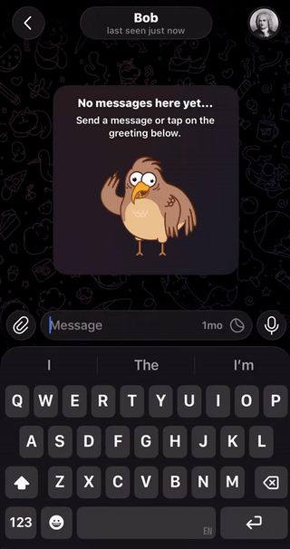

# Telegram LLM Translation Bot(@SendTranslatedBot)

[](https://github.com/nikita-holban/telegram-translate/actions/workflows/tests.yml)
[](https://github.com/nikita-holban/telegram-translate/actions/workflows/deploy.yml)
[](LICENSE)



You can try it here: [@SendTranslatedBot](https://t.me/SendTranslatedBot)

A Telegram **inline** bot that translates text with an LLM. While chatting with
anyone — including a private chat with another person — type `@yourbot some
text` and tap the result to send the translation.

Two translation engines are supported and each user picks their own:

- **Claude (Anthropic)** — the default.
- **Google Translation LLM** — Google Cloud Translation's LLM model.

## How it works

- **Inline mode**: the bot only sees the text you type after its username, so
  it never reads anyone's chat. You pick the translated result and send it
  yourself.
- **Target language**: each user sets a default with `/setlang`. Any single
  query can override it with a prefix, e.g. `@yourbot fr: good morning`.
  `/setlang` understands over 130 languages by English name, native name
  (`Українська`, `Español`), or code, and offers tappable suggestions when
  you mistype (e.g. `Ukrannian` → `Ukrainian`). Replies show both names.
- **Translation engine**: each user picks Claude or Google with `/provider`.
- Telegram's inline API does not expose *which* chat a query came from, so
  settings are per **user**, not per chat. The `xx:` prefix is the
  per-conversation override.

## Setup

### 1. Create the bot in BotFather

1. Message [@BotFather](https://t.me/BotFather) → `/newbot` → copy the token.
2. `/setinline` → select your bot → set a placeholder (e.g. `Text to translate…`).
   **Inline mode must be enabled or inline queries never reach the bot.**

### 2. Configure a translation provider

Configure at least one provider (you can enable both).

**Anthropic (Claude)** — set `ANTHROPIC_API_KEY` from
[the console](https://console.anthropic.com/).

**Google Translation LLM**:

1. In a Google Cloud project, enable the **Cloud Translation API**.
2. Create a service account and download its JSON key file.
3. Set `GOOGLE_PROJECT_ID` and point `GOOGLE_APPLICATION_CREDENTIALS` at the
   key file.

### 3. Configure and run

```sh
cp .env.example .env
# edit .env: set BOT_TOKEN and at least one provider
```

This project uses [uv](https://docs.astral.sh/uv/).

```sh
uv sync                  # install dependencies
uv run python -m app.main
```

## Usage

| Action | Example |
| --- | --- |
| Translate into your default language | `@yourbot привет, как дела?` |
| Translate into a specific language | `@yourbot fr: good morning` |
| Set your default language | `/setlang Spanish` (or `/setlang es`) |
| Show your default | `/lang` |
| Choose your translation engine | `/provider google` (or `/provider claude`) |
| Help | `/start` or `/help` |

In a private chat with the bot you can also just send a language name (no
slash) to set your default.

## Configuration

All settings are environment variables (see `.env.example`):

| Variable | Required | Default | Purpose |
| --- | --- | --- | --- |
| `BOT_TOKEN` | yes | — | Telegram bot token |
| `ANTHROPIC_API_KEY` | if Claude used | — | Anthropic API key |
| `ANTHROPIC_MODEL` | no | `claude-haiku-4-5` | Translation model (Haiku for low latency) |
| `GOOGLE_PROJECT_ID` | if Google used | — | Google Cloud project ID (enables the Google provider) |
| `GOOGLE_LOCATION` | no | `us-central1` | Google Cloud region |
| `GOOGLE_APPLICATION_CREDENTIALS` | if Google used | — | Path to a service-account key file |
| `DEFAULT_PROVIDER` | no | `anthropic` | Provider for users who haven't run `/provider` |
| `DEFAULT_TARGET_LANG` | no | `English` | Fallback when a user has no `/setlang` |
| `DB_PATH` | no | `data/bot.db` | SQLite file for per-user settings |

## Tests

```sh
uv run pytest
```

Covers language resolution, typo suggestions, the SQLite settings store, and
provider selection. End-to-end inline translation requires a real `BOT_TOKEN`,
provider credentials, and a Telegram client.

## Project layout

```
app/
  main.py        entry point: Bot, Dispatcher, polling
  config.py      environment configuration
  handlers.py    /start /help /setlang /provider /lang + inline & callbacks
  providers/     translation backends (adapter, Anthropic, Google, registry)
  storage.py     aiosqlite per-user settings
  languages.py   inline prefix parsing, language resolution, suggestions
tests/           offline unit tests
```
